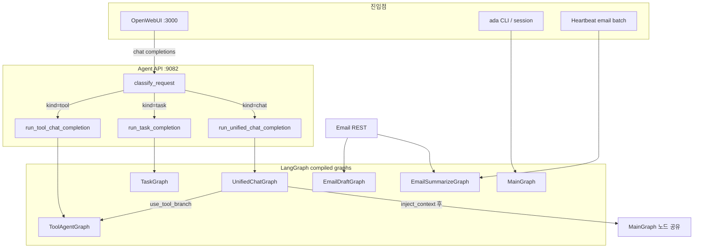
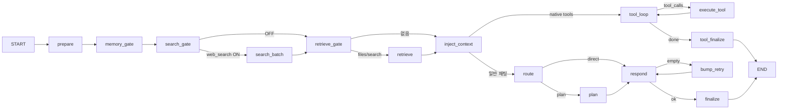
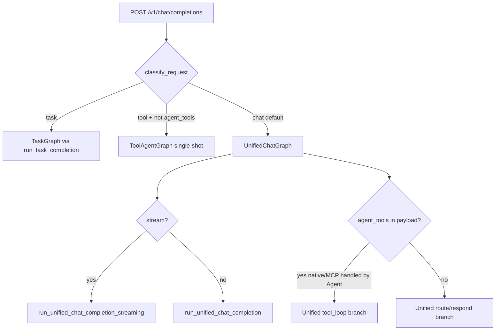

# Ada LangGraph 전체 구조

Open WebUI·CLI·이메일 heartbeat가 사용하는 **모든 LangGraph** 정의, 진입점, 노드 공유 관계를 한 문서에 정리합니다.

관련: [Agent README](README.md) (MainGraph 상세), [OWUI 마이그레이션](OWUI_LANGGRAPH_MIGRATION.md)

## 한 줄 요약

| 그래프 | 파일 | 용도 | 프로덕션 진입점 |
|--------|------|------|-----------------|
| **UnifiedChatGraph** | [`unified_graph.py`](../../../ada/src/ada/agent/unified_graph.py) | OWUI 일반 채팅 (메모리·검색·RAG·도구·응답) | Agent `:9082` `POST /v1/chat/completions` (chat) |
| **TaskGraph** | [`task_graph.py`](../../../ada/src/ada/agent/task_graph.py) | OWUI 백그라운드 task (제목·태그 등) | 동일 API (task) |
| **ToolAgentGraph** | [`tool_graph.py`](../../../ada/src/ada/agent/tool_graph.py) | OpenAI function-calling 1회/루프 | 동일 API (tool) + Unified 내부 |
| **MainGraph** | [`graph.py`](../../../ada/src/ada/agent/graph.py) | plan/route/respond 코어 (레거시·CLI) | `ada` CLI, [`session.py`](../../../ada/src/ada/agent/session.py), regression |
| **EmailSummarizeGraph** | [`email/graph.py`](../../../ada/src/ada/email/graph.py) | 수신 메일 요약·TODO 추출 | [`EmailPlatform`](../../../ada/src/ada/email/platform.py) + heartbeat |
| **EmailDraftGraph** | [`email/graph.py`](../../../ada/src/ada/email/graph.py) | 회신 초안 생성 | `EmailPlatform.draft_for_action` |

---

## 전체 관계도



**공유 관계:** UnifiedChatGraph는 MainGraph의 노드 구현([`nodes.py`](../../../ada/src/ada/agent/nodes.py))을 **그대로 재사용**합니다. MainGraph는 Unified의 “후반부(chat 응답)”와 동일한 plan/route/respond 체인입니다.

---

## 1. UnifiedChatGraph (프로덕션 채팅)

**정의:** [`build_unified_chat_graph()`](../../../ada/src/ada/agent/unified_graph.py)

**State:** [`UnifiedAgentState`](../../../ada/src/ada/agent/unified_state.py) — messages, metadata, memory/search/retrieve 결과, openai_tools, tool_rounds 등

**흐름:**



**노드별 동작** ([`unified_nodes.py`](../../../ada/src/ada/agent/unified_nodes.py)):

| 노드 | 조건 | 동작 |
|------|------|------|
| `memory_gate` | `metadata.features.memory` | OWUI/Agent memory backend 조회 → SystemMessage 주입 |
| `search_gate` / `search_batch` | `features.web_search` | Exa/Context7 등 [`run_search_batch`](../../../ada/src/ada/search/service.py) |
| `retrieve_gate` / `retrieve` | `metadata.files` 또는 search 결과 | RAG source fetch → `retrieve_sources` |
| `inject_context` | sources 있음 | RAG 템플릿으로 마지막 user 메시지 교체 |
| `tool_loop` | `is_native_tool_request` | LLM 1회 호출 → tool_calls 여부 판단 |
| `execute_tool` | tool_calls 있음 | [`OwuiToolBackend`](../../../ada/src/ada/tools/owui_backend.py) → OWUI `POST /tools/execute` |
| `route`~`finalize` | MainGraph와 동일 | 키워드/길이 휴리스틱 plan 분기, respond, 빈 응답 retry |

**호출:** [`run_unified_chat_completion()`](../../../ada/src/ada/agent/openai_compat.py) ← Agent [`server.py`](../../../ada/src/ada/agent/server.py) chat/streaming 경로

---

## 2. MainGraph (코어·레거시)

**정의:** [`build_main_agent_graph()`](../../../ada/src/ada/agent/graph.py)

**State:** [`AgentState`](../../../ada/src/ada/agent/state.py) — messages, route, plan, empty_retries

**흐름:** `prepare → route → [plan] → respond → (retry?) → finalize`

**진입점 (Unified 외):**

- [`run_chat_completion()`](../../../ada/src/ada/agent/openai_compat.py) — 구형 chat helper
- [`run_user_turn()`](../../../ada/src/ada/agent/graph.py) — CLI [`cli.py`](../../../ada/src/ada/cli.py), [`session.py`](../../../ada/src/ada/agent/session.py)
- regression [`test_main_graph_regression.py`](../../../ada/tests/regression/test_main_graph_regression.py)

**참고:** OWUI 프로덕션 채팅은 UnifiedChatGraph를 씁니다. MainGraph 단독 경로는 테스트·CLI·하위 호환용입니다. 노드·상태 상세는 [README](README.md) 참고.

---

## 3. TaskGraph (OWUI 백그라운드 task)

**정의:** [`build_task_graph()`](../../../ada/src/ada/agent/task_graph.py)

**State:** `TaskState` — task_kind, prompt, result

**흐름:** `prepare_task → llm_once → finalize_task` (LLM **1회**)

**task 종류** ([`task_templates.py`](../../../ada/src/ada/owui_adapt/task_templates.py)):

- `title_generation`, `tags_generation`, `follow_up_generation`, `autocomplete_generation` → LLM + JSON 정규화
- `query_generation` → **그래프 없음**, 휴리스틱만 (`heuristic_query_generation`)

**라우팅:** [`classify_request()`](../../../ada/src/ada/agent/classify.py) — `X-Ada-Request-Kind: task` 또는 `metadata.task`

**LLM 프로필:** `llm_registry["task"]` (경량 model, max_tokens 512)

---

## 4. ToolAgentGraph (function calling)

**정의:** [`build_tool_agent_graph()`](../../../ada/src/ada/agent/tool_graph.py)

**State:** `ToolAgentState` — openai_messages, tools, tool_rounds, assistant_message

**흐름:** `prepare → tool_loop ⇄ execute_tool → finalize`

**두 가지 사용 모드:**

| 모드 | `auto_execute` | 동작 |
|------|----------------|------|
| **Single-shot** (기본) | `False` | LLM 1회 → assistant + tool_calls 반환 (OWUI/MCP가 실행) |
| **Full loop** | `True` | 그래프 compile → execute까지 Agent 내부 반복 (eval harness) |

**진입점:**

1. Agent server `kind=tool` — OWUI가 tools 필드만 보내고 Agent가 context 처리 안 할 때
2. UnifiedChatGraph `tool_loop` — `is_agent_tool_request` + native function tools
3. Eval [`test_eval_harness.py`](../../../ada/tests/regression/eval/test_eval_harness.py)

**MCP 도구:** [`tool_policy.py`](../../../ada/src/ada/agent/tool_policy.py) — MCP는 OWUI middleware가 처리; Unified tool branch와 별도

---

## 5. EmailSummarizeGraph

**정의:** [`build_email_summarize_graph()`](../../../ada/src/ada/email/graph.py)

**State:** [`EmailState`](../../../ada/src/ada/email/state.py) — from, subject, body, summary_skip_rules 등

**흐름:**

```
prepare_email_context
  → extract_ada_instructions (TODO bullet 추출)
  → push_todo_queue (placeholder)
  → check_summary_skip (규칙 매칭)
  → [should_summarize] summarize_requests | skip_summary
  → finalize_inbox_item
```

**트리거:**

- [`EmailPlatform.summarize_message()`](../../../ada/src/ada/email/platform.py) — 단일 메일
- [`process_email_graph_batch()`](../../../ada/src/ada/email/platform.py) — heartbeat 주기 배치
- Email REST API (Agent [`build_email_router`](../../../ada/src/ada/email/api.py))

---

## 6. EmailDraftGraph

**정의:** [`build_email_draft_graph()`](../../../ada/src/ada/email/graph.py)

**흐름:** `prepare_reply_context → draft_reply → finalize_draft` (LLM 1회)

**트리거:** `EmailPlatform.draft_for_action()` — 사용자 회신 액션 시

---

## Agent API 라우팅 (OWUI → 그래프 선택)

[`server.py` `chat_completions`](../../../ada/src/ada/agent/server.py) + [`classify_request`](../../../ada/src/ada/agent/classify.py):



**분류 우선순위:**

1. Header `X-Ada-Request-Kind`
2. `metadata.task` → task
3. `payload.tools` 비어있지 않음 → tool (단, `is_agent_tool_request`면 chat+Unified로)
4. 그 외 → chat

---

## LLM 프로필·설정 연결

[`build_llm_registry()`](../../../ada/src/ada/agent/llm_registry.py) — [`agent.yaml`](../../../ada/config/agent.yaml) `models.*`:

| registry 키 | 그래프에서 사용 |
|-------------|----------------|
| `chat` | UnifiedChatGraph respond/plan, MainGraph |
| `task` | TaskGraph llm_once |
| `tool` | ToolAgentGraph, Unified tool_loop |

모든 upstream 호출은 [`LLMClient._model()`](../../../ada/src/ada/llm.py) → `effective_model_id()`로 MLX loaded model 우선 해석.

---

## 테스트·회귀 매핑

| 그래프 | 주요 테스트 |
|--------|-------------|
| MainGraph | [`test_main_graph_regression.py`](../../../ada/tests/regression/test_main_graph_regression.py), `test_agent_simple.py` |
| UnifiedChatGraph | [`test_unified_graph.py`](../../../ada/tests/test_unified_graph.py) |
| TaskGraph | [`test_task_graph.py`](../../../ada/tests/test_task_graph.py) |
| ToolAgentGraph | eval harness, tool policy tests |
| Email | [`test_email_graph.py`](../../../ada/tests/test_email_graph.py) |

---

## 읽을 때 기억할 점

1. **OWUI 일반 채팅 = UnifiedChatGraph** — MainGraph + memory/search/RAG/tools 전처리
2. **MainGraph 노드 = Unified 후반부** — [`nodes.py`](../../../ada/src/ada/agent/nodes.py) 공유
3. **TaskGraph / Email 그래프 = LLM 1~2회 고정** — plan/route 없음
4. **ToolAgentGraph = 두 얼굴** — 대부분 single-shot; Unified 내부만 execute 루프
5. **LangGraph 외 경로** — `query_generation` task, MCP middleware, heartbeat Gmail sync는 그래프 없이 별도 서비스
