# OWUI → Ada LangGraph 마이그레이션 계획

> **버전:** v0.6.42 · **계획 rev:** v4 (adversarial v5)  
> **Audit:** [OWUI_ORCHESTRATION_AUDIT.md](OWUI_ORCHESTRATION_AUDIT.md)  
> **상태:** Phase 1–3 ✅ · Phase 4B ✅ · Phase 5 ✅ · Phase 6 ✅ (feature flag; full vector migration follow-on)

---

## 1. 목표 · 측정

| 항목 | 목표 | Pass 기준 |
|------|------|-----------|
| 채팅 1턴 | UnifiedChatGraph 1 invoke | Agent graph trace 1회 |
| OWUI preprocess LLM | 0 (Phase 3+) | logs에 `generate_queries` 없음 |
| Search | Exa + Context7, vault | vault keys, OWUI Exa off |
| RAG | OWUI `get_sources_from_items` 동등 | ada `/retrieval/sources` |
| Memory | OWUI `query_memory` 동등 | ada JWT → `/memories/query` |
| Tools | Phase 2: Agent `tool_branch` (LLM) + OWUI 실행 (D14); Phase 3+: Agent 단독 (D11) | Phase 2: OWUI post-loop 유지; Phase 3: skip |
| Models | chat/task **프로필 분리** (기본값 동일 MLX) | Admin UI로 URL·model_id 변경 가능 |

---

## 2. Decision Log (D1–D14)

| # | 주제 | 결정 |
|---|------|------|
| D1 | title/tags/follow-up | TaskGraph + OWUI `/api/v1/tasks/*` |
| D2 | chat/task 모델 | **프로필 분리** + Admin UI (URL·model_id 각각 설정 가능) |
| **D12** | **기본 LLM** | **chat·task 둘 다** `base_url: http://127.0.0.1:8089/v1`, **`model_id: mlx-coder`** |
| D3 | RAG | OWUI vector, `RetrieveBackend` adapter |
| D4 | Web search | `features.web_search` → `search_gate` |
| D5 | Exa/Context7 | vault `exa.api_key`, `context7.api_key` |
| D6 | Graphs | UnifiedChatGraph + TaskGraph |
| D7 | JWT | `X-Ada-Owui-Authorization` OWUI→Agent→OWUI |
| D8 | RAG HTTP | `POST /api/v1/ada/retrieval/sources` (`get_sources_from_items`) |
| D9 | memory_gate | Phase 1 no-op → **Phase 2 `OwuiMemoryBackend`** → Phase 6 `AgentMemoryBackend` |
| D10 | Memory Phase 3–5 | **OWUI memory 최대 재사용** + adapter (D9), middleware skip은 Phase 3 |
| D11 | Tools | **Phase 3:** Agent Unified `tool_loop` **단독** (OWUI server loop skip). **Phase 2는 D14** |
| **D13** | **MCP/HTTP tools** | **Phase 2:** Agent `tool_loop` = payload `tools[]` **native function만**; MCP/HTTP tool은 **Phase 5까지** OWUI `process_chat_response` 유지 |
| **D14** | **Phase 2 tool 실행** | Agent = **LLM tool-call 라운드만**; callable 실행은 OWUI `metadata.tools` + `process_chat_response` (L2882–2998). D11 **완전 단독**은 Phase 3 skip과 함께 |

---

## 3. Graph · 분류

### 3.1 UnifiedChatGraph

```mermaid
flowchart LR
  classify --> prepare --> route --> memory_gate
  memory_gate --> search_gate --> search_batch
  search_batch --> retrieve_gate --> retrieve
  retrieve --> plan_gate --> plan
  plan --> tool_gate --> tool_loop
  tool_loop --> respond --> verify --> finalize
```



| 노드 | LLM | Profile | Phase |
|------|-----|---------|-------|
| classify | ❌ | — | 1 |
| memory_gate | ❌ | — | 1 stub / **2 backend** |
| search_batch | ❌ HTTP | — | 2 |
| retrieve query (opt) | ✅ | task | 2 |
| plan, tool_loop, respond | ✅ | chat | 2 |
| gates, prepare, route, verify, finalize | ❌ | — | 1–2 |

### 3.2 classify (RequestKind)

**우선순위 (Agent `server.py` / `classify_request`):**

1. Header `X-Ada-Request-Kind: task|tool|chat`
2. `X-OpenWebUI-Metadata` JSON → `metadata.task` 존재 → **task**
3. OpenAI payload `tools` non-empty → **tool** (Phase 2까지 기존 ToolGraph fast path 허용, Phase 2+ Unified)
4. default → **chat**

| Kind | Graph | 비고 |
|------|-------|------|
| task | TaskGraph | title/tags/… |
| tool | Unified tool_loop | D11 |
| chat | UnifiedChatGraph | |

### 3.3 TaskGraph (Phase 1 최소)

**Phase 1 scope:** `TITLE_GENERATION` only (regression 증명).  
**Phase 4B:** tags, follow_up, autocomplete.

노드: `prepare_task` → `llm_once` → `finalize_task` (plan/respond **없음**).

---

## 4. 인프라 · 환경

### 4.1 포트 ( [`ports.py`](../../src/ada/ports.py) 정합)

| 서비스 | 기본 포트 | 설정 |
|--------|-----------|------|
| MLX (chat + task **기본**) | **8089** | `ADA_MLX_PORT` / `models.chat.base_url` / `models.task.base_url` |
| MLX task (선택 분리) | 8090 등 | Admin UI에서 task URL만 변경 시 (D2) |
| Agent | **9082** | `ADA_AGENT_PORT` |
| OWUI | **3000** | docker → 8080 |

**D12:** 초기 배포는 chat·task **동일 포트·동일 model_id** (`mlx-coder` @ `:8089`). 경량 전용 MLX는 Admin에서 task 프로필만 바꿔 분리.

### 4.2 Agent env

| 변수 | 기본 | 용도 |
|------|------|------|
| `ADA_OWUI_BASE_URL` | `http://127.0.0.1:3000` | Agent→OWUI HTTP |
| `ADA_AGENT_HANDLES_CONTEXT` | unset / `0` | `1` = Phase 3 middleware skip |
| `MLX_UPSTREAM` | chat MLX | chat profile override |

Docker Agent → OWUI: `http://host.docker.internal:3000`

### 4.3 환경 검증 (사람 실행)

| 대상 | 명령 | Pass |
|------|------|------|
| MLX | `curl -sf :8089/v1/models` | **200** |
| Agent | `curl -sf :9082/health` | **200** |
| OWUI | `curl -sf :3000/health` | **200** |
| model id | Agent chat/task 요청 시 OpenAI `model: mlx-coder` | payload 일치 |

**D12 기본:** task 전용 `:8090` **필수 아님**. §4.4는 task URL을 Admin에서 분리할 때만 적용.

### 4.4 Task MLX 분리 (선택 — D2)

경량 모델을 **별도 포트**로 띄울 때만:

```bash
# 예: Admin Task URL을 :8090으로 바꾼 뒤
mlx_lm.server --model <light-model> --port 8090
curl -sf http://127.0.0.1:8090/v1/models
```

Admin UI: Task base URL / Task model id 저장. Chat 프로필은 `:8089` + `mlx-coder` 유지 가능.

---

## 5. 모델 설정 (D2)

### 5.1 설정 SSOT

**Primary:** [`agent.yaml`](../../config/agent.yaml) `models:`  
**Secondary:** [`model_registry.yaml`](../../config/model_registry.yaml) — `chat_profile`, **`task_profile`** (base_url은 agent.yaml이 override)

```yaml
# agent.yaml — 기본값 (D12)
models:
  chat:
    base_url: http://127.0.0.1:8089/v1
    model_id: mlx-coder
    api_key: local
  task:
    base_url: http://127.0.0.1:8089/v1   # D12: chat와 동일 포트
    model_id: mlx-coder                  # D12: 동일 model id
    api_key: local
    max_tokens: 512                      # task만 출력 상한 (경량 호출 절약)
  tool: chat
```

[`model_registry.yaml`](../../config/model_registry.yaml) 예시:

```yaml
profiles:
  chat_profile:
    base_url: http://127.0.0.1:8089/v1
    api_key: local
    tool_calling: true
  task_profile:
    base_url: http://127.0.0.1:8089/v1
    api_key: local
    tool_calling: false
    notes: Default model_id mlx-coder via agent.yaml models.task
```

`Profile`: +`model_id: str = ""`, +`max_tokens: int | None = None`

**런타임:** `build_llm_registry`가 `agent.yaml` `models.*`를 SSOT로 사용. upstream OpenAI `model` 필드는 **`effective_model_id()`**로 해석 — MLX `/health`의 **loaded model 우선**, 없을 때 config `model_id`(선호값) 또는 `GET /v1/models` fallback.

### 5.2 `build_llm_registry(cfg) -> dict[str, Callable]`

| 키 | Profile | 용도 |
|----|---------|------|
| `chat` | models.chat | plan, respond, tool_loop |
| `task` | models.task | retrieve query, search decompose, TaskGraph |
| `tool` | alias chat | D11 |

Fallback: task `base_url` unreachable → chat profile + `log.warning` (Admin에서 task URL만 잘못된 경우).

### 5.3 Ops API

```
GET  /ops/agent/models
PUT  /ops/agent/models   # persist agent.yaml, reload registry
GET  /ops/agent/models/test?profile=chat|task  # proxy GET {base}/v1/models
```

Proxy: `/api/v1/ada/agent/ops/agent/models` (admin only).

### 5.4 Admin UI — `AdaAgentModels.svelte`

| 필드 | 기본값 (D12) |
|------|----------------|
| Chat base URL | `http://127.0.0.1:8089/v1` |
| Chat model id | `mlx-coder` |
| Task base URL | `http://127.0.0.1:8089/v1` |
| Task model id | `mlx-coder` |

[Test], [Save] — secrets 없음.

---

## 6. OWUI ↔ Agent 헤더

| 헤더 | Phase | Max | 내용 |
|------|-------|-----|------|
| `X-Ada-Request-Kind` | 1 | 16B | chat \| task \| tool |
| `X-Ada-Owui-Authorization` | 2 | 8KB | Bearer JWT |
| `X-OpenWebUI-Metadata` | 2 | **65536** | allowlist JSON |

**Allowlist keys:** `features`, `files`, `chat_id`, `message_id`, `tool_ids`, `tool_servers`, `collection_names`, `task`, `task_body`, `filter_ids`  
**Reject:** >64KB → HTTP 413; unknown keys stripped; JWT in JSON **금지**.

**openai.py patch (L903 직후):**

```python
# pseudocode — apply-overrides.py
if metadata:
    headers["X-OpenWebUI-Metadata"] = json.dumps(metadata, ensure_ascii=False)[:65536]
    headers["X-Ada-Request-Kind"] = "chat"
if auth := headers.get("Authorization"):
    headers["X-Ada-Owui-Authorization"] = auth
```

**tasks.py:** `metadata.task` 있으면 `X-Ada-Request-Kind: task`.

**Agent:** parse headers → `AgentState.metadata`; JWT **state 저장 금지** — retrieve/memory HTTP 직전만 bytearray → zero.

---

## 7. Web Search (D4–D5)

### 7.1 search_gate

**필수:** `metadata.features.web_search is True`

| 조건 | Provider |
|------|----------|
| framework/lib/API/how/install/doc/ref | Context7 |
| news/today/stock/weather/2025/2026/최신 | Exa |
| both patterns | both (max 2 requests) |
| vault key missing | skip provider |

Config: `search.max_requests_per_turn: 3`

### 7.2 Context7 (존재 확인됨)

| Step | HTTP | Auth |
|------|------|------|
| search lib | `GET https://context7.com/api/v2/libs/search?libraryName=&query=` | `Authorization: Bearer {vault}` |
| get context | `GET https://context7.com/api/v2/context?libraryId=&query=&type=json` | 동일 |

구현: [`search/context7.py`](../../src/ada/search/context7.py)

### 7.3 Exa

Vendored [`owui_adapt/exa.py`](../../src/ada/owui_adapt/exa.py) · vault `exa.api_key`

---

## 8. RAG (D3, D7, D8)

### 8.1 OWUI overlay

```
POST /api/v1/ada/retrieval/sources
Authorization: Bearer <JWT>
{ "items": [...], "queries": [...], "full_context": false }
→ { "sources": [...] }  # get_sources_from_items 동일
```

### 8.2 Agent `OwuiRetrievalBackend`

```
POST {ADA_OWUI_BASE_URL}/api/v1/ada/retrieval/sources
Timeout 120s · fail → empty · respond continues
```

`retrieve_gate`: `metadata.files` 또는 search 후 `web_search` items.

---

## 9. Memory (D9, D10)

### 9.1 OWUI 기존

- middleware `chat_memory_handler` → `query_memory` in-process
- HTTP: `POST /api/v1/memories/query` ([`memories.py`](../../../web/open-webui/backend/open_webui/routers/memories.py) L80, `get_verified_user`)

### 9.2 Agent adapter

```python
class MemoryBackend(Protocol):
    async def query(self, content: str, k: int, jwt: str) -> MemoryResult: ...

class OwuiMemoryBackend:
    POST {ADA_OWUI_BASE_URL}/api/v1/memories/query
    Body: {"content": "<user msg>", "k": 3}
    Authorization: Bearer <jwt>
```

**memory_gate:** `features.memory is True` → backend → `state.memory_context` → respond SystemMessage inject.

Phase 1: pass-through. Phase 2: backend active (JWT 헤더 필요).

Phase 6: `AgentMemoryBackend` — OWUI vector 이전.

---

## 10. Tools (D11)

### 10.1 Phase 2+ (D11, D13, D14)

- OWUI middleware: **tool 정의 수집** (`tool_ids`, MCP) → payload `tools[]` + metadata 유지
- Agent UnifiedGraph: `tool_gate` → `tool_branch` → LLM `tool_calls` 생성 (**D14:** 실행은 OWUI `process_chat_response` L2882–2998)
- **D13:** MCP / HTTP tool servers → **Phase 5까지** OWUI post-loop 유지
- **D14:** Phase 2 = LLM only; D11 **완전 단독** = Phase 3 middleware skip
- `server.py`: native `tools[]` + no `tool_servers` → UnifiedGraph tool_branch

### 10.2 Phase 3 OWUI skip

`ADA_AGENT_HANDLES_CONTEXT=1` 시 **skip:**

| Handler | 이유 |
|---------|------|
| `chat_web_search_handler` | Agent search |
| `chat_completion_files_handler` | Agent retrieve (+ metadata.files 유지) |
| `chat_memory_handler` | Agent memory_gate |
| ~~`process_chat_response` native tool loop~~ | **Phase 3:** native + no MCP → `tool_calls.clear()` (D11); MCP는 Phase 5 |

**유지 (skip 안 함):**

| Handler | 이유 |
|---------|------|
| `convert_url_images`, system prompt, folder/model knowledge **files list** | metadata 구성 |
| `chat_image_generation_handler` | Phase 5까지 OWUI (out of scope) |
| `code_interpreter` prompt inject | UI feature |
| pipeline/filter inlet | 사용자 filter |

---

## 11. Overlay 패치 · 검증

| 파일 | Phase | 변경 |
|------|-------|------|
| `routers/openai.py` | 2 | §6 headers |
| `routers/tasks.py` | 1 | RequestKind=task |
| `routers/ada.py` | 2 | `/retrieval/sources` (+ optional proxy) |
| `utils/middleware.py` | 3 | §10.2 skip block |
| `apply-overrides.py` | 1–3 | anchors + verify |
| `AdaAgentModels.svelte` | 1 | Admin UI |

**verify-open-webui-ada.sh 확장 (Phase 5):** grep `X-Ada-Request-Kind`, `retrieval/sources`, `ADA_AGENT_HANDLES_CONTEXT`.

---

## 12. Phase 실행 · DoD

### Phase 0 ✅

- [x] [OWUI_ORCHESTRATION_AUDIT.md](OWUI_ORCHESTRATION_AUDIT.md)

### Phase 1 DoD

- [x] `classify_request()` + TaskGraph title
- [x] `build_llm_registry`, agent.yaml `models`, task_profile
- [x] GET/PUT `/ops/agent/models` + AdaAgentModels UI
- [x] openai.py overlay RequestKind + metadata header (tasks.py 별도 패치 불필요)
- [x] `test_task_graph.py`: 1 LLM, no `[plan]`, task URL or fallback logged
- [x] `./scripts/verify-regression.sh` PASS
- [x] `memory_gate` → OwuiMemoryBackend / AgentMemoryBackend (`ADA_USE_AGENT_BACKENDS`)

### Phase 2 DoD

- [x] §6 headers + Phase 2 metadata allowlist (`features`, `files`, …)
- [x] `POST /api/v1/ada/retrieval/sources` (G2)
- [x] OwuiRetrievalBackend + OwuiMemoryBackend + search_batch
- [x] UnifiedChatGraph (memory/search/retrieve/inject_context)
- [x] tool_branch: LLM + `tools[]` 응답, **실행은 OWUI** (D14)
- [x] pytest: web_search, unified_graph, owui_retrieval, owui_memory (16 passed)
- [x] regression 23 PASS
- [x] **VAULT.md:** `exa.api_key`, `context7.api_key` 문서화
- [x] **E2E:** `verify-phase2-owui.sh` (agent chat smoke + optional JWT retrieval)
- [x] **허용:** Phase 3 전까지 OWUI middleware 이중 preprocess

### Phase 3 DoD

- [x] `ADA_AGENT_HANDLES_CONTEXT=1` + §10.2 (`apply-overrides.py`, `docker-compose.yml`)
- [x] `verify-llm-budget.sh` PASS (overlay grep + pytest 8; docker live budget optional)
- [x] **E2E:** `verify-migration-e2e.sh` (stack health + task title smoke)

### Phase 4B DoD

- [x] TaskGraph: `tags_generation`, `follow_up_generation`, `autocomplete_generation`
- [x] `query_generation` heuristic stub (no LLM)
- [x] `test_task_graph.py` expanded

### Phase 5 DoD

- [x] MCP tools via `ada/tools/execute` + Agent `is_agent_tool_request`
- [x] middleware MCP post-loop skip (`tool_calls.clear()` without mcp exclusion)
- [x] `verify-phase5-mcp.sh` + `verify-open-webui-ada.sh` anchors

### Phase 6 DoD

- [x] `AgentMemoryBackend` + `AgentRetrievalBackend` + `ADA_USE_AGENT_BACKENDS`
- [x] [`VECTOR_MIGRATION.md`](VECTOR_MIGRATION.md) rollout/rollback
- [x] Local retrieval index (`retrieve/local_store.py`) + import scripts
- [ ] OWUI Chroma full parity (embedding/hybrid) — optional upgrade beyond keyword index

### Phase 4B · 5 · 6 (legacy bullet list)

- 4B: TaskGraph tags/follow_up/autocomplete — **done** (see Phase 4B DoD)
- 5: middleware search query gen removed, docs, verify script — **partial** (MCP done; dead path docs)
- 6: AgentMemoryBackend + AgentRetrievalBackend — **done** (factory + feature flag)

---

## 13. 테스트 · 스크립트

### 13.1 `verify-llm-budget.sh` (Phase 3)

```bash
#!/usr/bin/env bash
# 1. Stack up: ada.sh start, OWUI, ADA_AGENT_HANDLES_CONTEXT=1
# 2. Chat with web_search OFF, no files → count Agent→8089 completions (expect 1)
# 3. docker logs open-webui 2>&1 | grep -c generate_queries → expect 0
# 4. POST /api/v1/tasks/title/completions → Agent logs model mlx-coder @ :8089 (task profile)
# exit 0 / 1
```

### 13.2 pytest 신규

| 파일 | asserts |
|------|---------|
| `test_task_graph.py` | title, 1 call, `model=mlx-coder`, task profile |
| `test_web_search.py` | gate + mock Exa/Context7 |
| `test_unified_graph.py` | 1 invoke; mocks; tool_branch returns tool_calls (D14, no Agent execute) |
| `test_owui_retrieval_backend.py` | JWT header, sources schema |
| `test_owui_memory_backend.py` | JWT, memory inject |

### 13.3 `verify-phase2-owui.sh` (Phase 2 마무리)

```bash
./scripts/verify-phase2-owui.sh
# 선택: OWUI_JWT=<token> ./scripts/verify-phase2-owui.sh
```

overlay grep · phase2 pytest 16 · stack health(optional) · JWT retrieval(optional).

---

## 14. Adversarial Plan Review v3

### STEP 1 — 존재 검증

| 항목 | 종류 | 존재 | 버전/검증 |
|------|------|------|-----------|
| OWUI audit doc | doc | **확인됨** | OWUI_ORCHESTRATION_AUDIT.md |
| get_sources_from_items | fn | **확인됨** | retrieval/utils.py:921 |
| POST /memories/query | API | **확인됨** | memories.py:80 |
| Context7 /v2/libs/search, /v2/context | API | **확인됨** | context7.com/docs |
| Agent graph (current) | code | **확인됨** | graph.py prepare→respond |
| ToolGraph | code | **확인됨** | tool_graph.py |
| task_graph, UnifiedGraph extensions | plan | 구현 전 | Phase 1–2 |
| ada `/retrieval/sources` | plan | 구현 전 | Phase 2 |
| task MLX :8090 | infra | **선택** (D12 기본 :8089) | §4.4 Admin 분리 시만 |
| verify-llm-budget.sh | script | **확인됨** | Phase 3 |

### STEP 2 — 요구사항 대조

| 항목 | 상태 |
|------|------|
| D1–D12 | ✅ |
| Memory adapter D10 | ✅ §9 |
| Tools D11 | ✅ §10 |
| Middleware skip scope | ✅ §10.2 |
| RAG D8 | ✅ |
| Phase 1 title only | ✅ §3.3 |

### STEP 3 — 의도 vs 계획

| 항목 | 일치 |
|------|------|
| OWUI memory/RAG 재사용 + 내재화 | ✅ adapter |
| Agent tool_loop Phase 2 | ✅ D11 |
| OWUI preprocessing LLM 0 | ✅ Phase 3 |

### STEP 4 — 엣지 케이스

| 진입점 | 완화 |
|--------|------|
| metadata 64KB | 413 |
| JWT expire | memory/retrieve skip |
| 8090 down | task URL이 chat와 다를 때만 → chat fallback |
| vault lock | search skip |
| tools MCP auth | OWUI still assembles tools[]; Agent execute errors → tool message |

### STEP 5 — 사람 실행 (역사; 2026-06 갱신)

- [x] §4.3 MLX :8089 — `verify-migration-e2e` / `verify-ada` (Agent·OWUI는 `./scripts/ada.sh start` TTY 필요)
- [ ] (선택) §4.4 task 포트 분리 후 curl
- [ ] Phase 2 JWT E2E — `OWUI_JWT=... ./scripts/verify-phase2-owui.sh`
- [x] Phase 3 verify-llm-budget.sh
- [ ] vendor bump apply-overrides (v0.6.42+ 시)

### STEP 6 — 판정

```
판정: APPROVE-WITH-CONDITIONS
조건 (구현 착수 게이트):
  1. Phase 1: §4.3 MLX :8089 + Agent + OWUI → 즉시 착수 (D12: chat/task 동일 mlx-coder)
  2. (선택) Admin에서 task URL 분리 시 §4.4 검증
  3. Phase 3: verify-llm-budget.sh 구현 후 E2E

TOP 3:
  1. chat/task 동일 모델 시 task max_tokens만으로 경량화 — 분리 시 Admin 변경
  2. overlay anchor v0.6.42
  3. JWT scrub
```

---

## 15. 파일 변경

| 영역 | 경로 |
|------|------|
| Classify | `agent/classify.py`, `server.py` header parse |
| Graph | `graph.py`, `nodes.py`, `state.py`, `task_graph.py` |
| Backends | `retrieve/owui_backend.py`, `memory/owui_backend.py` |
| Search | `search/context7.py`, `search/service.py`, `owui_adapt/` |
| Config | `agent.yaml`, `model_registry.yaml`, `agent/config.py` |
| Overlay | `ada.py`, openai/tasks/middleware patches |
| UI | `AdaAgentModels.svelte`, `ada.ts` |
| Scripts | `verify-llm-budget.sh`, `verify-phase2-owui.sh` |
| Tests | §13.2 |

---

## 16. Out of scope

- OWUI chat UI rewrite
- Phase 6 전 vector DB migration
- 15+ search engines
- Image generation Agent 이전 (Phase 5까지 OWUI)
- MCP subprocess Context7

---

## 17. Phase 1 Implementation Addendum (즉시 착수용)

> 숙련 개발자 리뷰 반영. **Phase 1만** 아래대로 하면 추가 결정 없이 구현 가능.

### 17.1 OWUI → Agent task 분류 (필수)

`metadata`는 [`openai.py` L807](../../../web/open-webui/backend/open_webui/routers/openai.py)에서 **pop**되어 Agent body에 없음.  
**tasks.py만 패치하면 불충분** — **openai.py**에서 pop **직전** 헤더 주입:

```python
metadata = payload.pop("metadata", None) or {}
if metadata.get("task"):
    headers["X-Ada-Request-Kind"] = "task"
headers["X-OpenWebUI-Metadata"] = json.dumps(
    {k: metadata[k] for k in METADATA_ALLOWLIST if k in metadata},
    ensure_ascii=False,
)[:65536]
auth = headers.get("Authorization")
if auth:
    headers["X-Ada-Owui-Authorization"] = auth
```

Phase 1 allowlist: `task`, `task_body`, `chat_id` 만 (전체 allowlist는 Phase 2).

### 17.2 `features` metadata 누락 (Phase 2 선행 패치)

현재 middleware L1308: `features = form_data.pop("features")` — **metadata에 안 넣음**.  
D4 `search_gate` 불가. **Phase 2 전** middleware 패치:

```python
# L1374 metadata = { ... } 직전
if features:
    metadata["features"] = features
```

### 17.3 Agent `classify_request` (신규 `agent/classify.py`)

```python
def classify_request(
    headers: Mapping[str, str],
    payload: dict[str, Any],
) -> Literal["chat", "task", "tool"]:
    kind = headers.get("x-ada-request-kind", "").strip().lower()
    if kind in ("chat", "task", "tool"):
        return kind  # type: ignore
    meta_raw = headers.get("x-openwebui-metadata")
    if meta_raw:
        meta = json.loads(meta_raw)  # invalid → chat
        if meta.get("task"):
            return "task"
    tools = payload.get("tools")
    if isinstance(tools, list) and tools:
        return "tool"
    return "chat"
```

### 17.4 `server.py` 분기 (Phase 1)

```python
kind = classify_request(request.headers, payload)
if kind == "task":
    # TaskGraph — stream=False 강제 (OWUI task는 non-stream)
    content = await asyncio.to_thread(run_task_completion, payload, task_llm, cfg)
    body = build_chat_completion_response(task_model_id, content)
elif has_tools:
    ...  # Phase 1: 기존 ToolGraph 유지
else:
    ...  # 기존 MainGraph
```

`task_model_id` = `cfg.models.task.model_id or "mlx-coder"`.

### 17.5 `AgentConfig` 확장 (`agent/config.py`)

```python
@dataclass(frozen=True)
class ModelEndpointConfig:
    base_url: str
    model_id: str = ""
    api_key: str = "local"
    max_tokens: int | None = None

@dataclass(frozen=True)
class ModelsConfig:
    chat: ModelEndpointConfig
    task: ModelEndpointConfig
    tool_alias: str = "chat"  # yaml key: tool: chat

# AgentConfig + models: ModelsConfig | None
```

`load_agent_config`: `raw["models"]` 파싱, 없으면 D12 default factory.

### 17.6 `LLMClient` + `Profile.model_id`

[`llm.py`](../../src/ada/llm.py) `_model()`:

```python
if self.profile.model_id:  # NEW field on Profile OR wrapper ModelEndpointConfig
    return self.profile.model_id
return effective_model_id(...)
```

`make_llm_callable(endpoint: ModelEndpointConfig, ...)` — `Profile`를 endpoint로부터 합성:

```python
Profile(name="task", label="task", provider="openai-compatible",
        base_url=endpoint.base_url, api_key=endpoint.api_key, model_id=endpoint.model_id)
```

`chat_completion(..., max_tokens=)` — task 호출 시 `endpoint.max_tokens or 512`.

### 17.7 `build_llm_registry(cfg)`

```python
def build_llm_registry(cfg: AgentConfig, vault=None, stream_ctx=None) -> dict[str, Callable]:
    chat_ep = cfg.models.chat
    task_ep = cfg.models.task
    return {
        "chat": make_llm_callable(profile_from(chat_ep), vault_session=vault, stream_context=stream_ctx),
        "task": make_llm_callable(profile_from(task_ep), vault_session=vault),
    }
```

### 17.8 `task_graph.py` — title only

**입력:** `metadata.task` == `"title_generation"` (OWUI `TASKS.TITLE_GENERATION` 문자열 — vendored constants에서 grep 확인 후 enum 상수로 고정).

**프롬프트:** Phase 1은 OWUI [`title_generation_template`](../../../web/open-webui/backend/open_webui/utils/task.py) 를 `owui_adapt/task_templates.py`에 **copy** (10~30줄). `task_body["messages"]` + template → user message 1개.

**그래프:** `prepare_task` → `llm_once` (registry `task`) → `finalize_task` → OpenAI JSON 응답 (content = title string).

**금지:** plan/respond 노드, `[plan]` trace.

### 17.9 Ops API (`server.py`)

```python
@app.get("/ops/agent/models")
@app.put("/ops/agent/models")
@app.get("/ops/agent/models/test")
```

- PUT body: `{ "chat": {...}, "task": {...} }` — `ada_root()/config/agent.yaml` atomic write (`path.tmp` + `replace`)
- Reload: `load_agent_config()` in-process cache on `create_app` → use `app.state.agent_cfg` mutable reload

### 17.10 Admin UI

- Tab: `ada-agent` under Settings (mirror `ada-email` in `apply-overrides.py`)
- Files: `AdaAgentModels.svelte`, `ada.ts` → `getAdaAgentModels` / `putAdaAgentModels` → `/api/v1/ada/agent/ops/agent/models`
- i18n: `open-webui-overlays/i18n-additions.json` — `"Ada Agent Models"`

### 17.11 `memory_gate` Phase 1

```python
def memory_gate_node(state):  # no-op
    return {}  # edge always → search_gate
```

UnifiedGraph에 노드만 추가; MainGraph Phase 1은 **미변경** (chat 경로).

### 17.12 Phase 1 테스트

```python
# test_task_graph.py — mock LLMClient
def test_title_task_one_llm_no_plan(mock_task_llm):
    payload = {"messages": [...], "metadata": {"task": "title_generation", ...}}
    # assert mock called once, max_tokens<=512, model mlx-coder
    # assert "[plan]" not in trace
```

Regression: 기존 22 tests PASS (MainGraph unchanged for chat).

---

## 18. Phase 2+ 갭 트래커

| # | gap | Phase 2 (§20) | 후속 |
|---|-----|---------------|------|
| G1 | `features` metadata | ✅ PR0 middleware 패치 | — |
| G2 | `/retrieval/sources` | ✅ PR0 handler 스펙 | — |
| G3 | search heuristics | ✅ PR2 `search/heuristics.py` | — |
| G4 | rag inject | ✅ PR2 user-msg `rag_template` (OWUI L1603–1610) | — |
| G5 | middleware skip | ✅ Phase 3 | — |
| G6 | MCP vs native | ✅ D13+D14 | ✅ Phase 5 MCP Agent execute |
| G7 | UnifiedGraph | ✅ PR3 state+graph | — |
| G8 | tool loop skip | ✅ Phase 3 native | ✅ Phase 5 MCP skip |
| G9 | Context7 스키마 | PR2 gate: curl fixture | — |
| G10 | vault search keys | PR2 gate: `exa.api_key`, `context7.api_key` | `VAULT.md` |

---

## 19. Adversarial v4 — (역사) Phase 1 판정

Phase 1: §17 기준 **구현 완료**. Phase 2 판정은 §21 참조.

---

## 20. Phase 2 Implementation Addendum

### 20.0 결정 D14 — Tool 실행 (리뷰 blocking 해소)

OWUI `metadata.tools`는 **Python callable** — Agent로 직렬화 불가 (`middleware.py` L1549).

| Phase | Agent | OWUI `process_chat_response` |
|-------|-------|------------------------------|
| **2 (D14)** | `tool_branch`: LLM이 `tools[]`로 **tool_calls 생성**까지만 | L2882–2998에서 `metadata.tools`로 **실행** |
| **3** | Agent tool_loop **단독** (middleware skip) | native post-loop skip |
| **5** | MCP 이전 | MCP post-loop skip |

Phase 2 UnifiedGraph에 **`execute_tool` 노드 없음** — `tool_loop` → respond/finalize 시 `tool_calls` 유지.

### 20.1 범위

**포함:** G1–G4, G6–G7, D14 tool_branch, JWT scrub, vault search keys.  
**제외:** G5/G8 skip, `verify-llm-budget.sh`, TaskGraph 4B, `POST /tools/execute` overlay (Phase 5 검토).  
**허용:** Phase 3 전 OWUI+Agent **이중 preprocess** (web_search/memory/files).

### 20.2 PR0 — Overlay (G1, G2)

**G1** — `middleware.py` L1374 직전:

```python
if features:
    metadata = {**metadata, "features": features}
```

**openai.py** — Phase 2 allowlist: `features`, `files`, `chat_id`, `message_id`, `tool_ids`, `tool_servers`, `collection_names`, `task`, `task_body`, `filter_ids`. 헤더는 필터 결과가 비어 있지 않으면 항상 전송.

**G2** — `ada.py`:

```python
class RetrievalSourcesForm(BaseModel):
    items: list[dict] = []
    queries: list[str]  # Agent: non-empty 필수 (last user text)
    full_context: bool = False
```

`get_sources_from_items(...)` wiring = middleware L1006–1030 동일. `queries` 빈 배열이면 HTTP 400.

`apply-overrides.py`: `patch_middleware_features`, openai allowlist 확장, `copy_backend_overlay`에 retrieval route 포함.

### 20.3 PR1 — Backends + JWT

- `ADA_OWUI_BASE_URL` + `ports.owui_base_url()`
- `agent/jwt_context.py`: bytearray, `secure_zero` at request end
- `memory/owui_backend.py`: `POST /api/v1/memories/query`, k=3, 404→empty
- `retrieve/owui_backend.py`: `POST /api/v1/ada/retrieval/sources`, timeout 120s

### 20.4 PR2 — Search (G3, G4, G9, G10)

**PR2 착수 gate (사람):**

```bash
curl -sf -H "Authorization: Bearer $CONTEXT7_KEY" \
  "https://context7.com/api/v2/libs/search?libraryName=fastapi&query=routing" \
  | tee ada/tests/fixtures/context7_libs_search.json
make vault-set KEY=exa.api_key   # 문서화
make vault-set KEY=context7.api_key
```

- `search/heuristics.py` — regex 표 (§7.1)
- `owui_adapt/exa.py` — vendored `search_exa`, httpx
- `search/context7.py` — fixture 기반 파서 + live optional
- `search_batch`: queries=`[last_user_text]` (OWUI `generate_queries` LLM 없음)
- `owui_adapt/rag.py` — `DEFAULT_RAG_TEMPLATE` + `sources_to_context_string`; inject = **user message** 교체

### 20.5 PR3 — UnifiedChatGraph (G7)

**AgentState 확장:** `metadata`, `memory_context`, `search_items`, `retrieve_sources`, `openai_tools`, `tool_rounds`.

```
prepare → memory_gate → search_gate → [search_batch] → retrieve_gate → [retrieve]
  → inject_context → route → [plan] → tool_gate → [tool_loop] → respond → verify → finalize
```

- `tool_gate`: `is_native_tool_request` (no `tool_servers`, all `type=function`)
- `tool_loop`: chat LLM + tools; **tool_calls 있으면 그대로 반환** (D14)
- `build_main_agent_graph` regression용 유지

**server.py:** `kind==task` → TaskGraph; else `run_unified_chat_completion` (chat + D14 tool_branch).

### 20.6 PR4 — 테스트 · DoD

| 파일 | asserts |
|------|---------|
| `test_web_search.py` | heuristics; mock Exa/Context7 |
| `test_owui_retrieval_backend.py` | JWT header; queries non-empty |
| `test_owui_memory_backend.py` | 404→empty; User Context format |
| `test_unified_graph.py` | 1 invoke; mocks; tool_branch returns tool_calls without execute |

`verify-regression.sh` 23 PASS 유지.

---

## 21. Adversarial v5 — Phase 2 계획 (§20 반영 후)

### STEP 1 — 존재 검증

| 항목 | 종류 | 존재 | 검증 |
|------|------|------|------|
| `get_sources_from_items` | OWUI fn | 확인됨 | `retrieval/utils.py:921` |
| `search_exa` | OWUI fn | 확인됨 | `exa.py:20` |
| `rag_template` | OWUI fn | 확인됨 | `task.py:187` |
| `metadata.tools` callables | OWUI runtime | 확인됨 | `middleware.py:1549` |
| Context7 API | HTTP | **PR2 gate** | curl → fixture (§20.4) |
| vault `exa.api_key` | vault key | **PR2 gate** | `make vault-set` |
| Phase 2 Ada code | 구현 | 구현 전 | PR0–PR4 |

### STEP 2 — 요구사항 대조

| DoD | §20 | 상태 |
|-----|-----|------|
| headers + allowlist | 20.2 | 스펙 완료 |
| retrieval/sources | 20.2 | 스펙 완료 |
| backends + search | 20.3–20.4 | 스펙 완료 |
| UnifiedGraph | 20.5 | 스펙 완료 |
| tool (D11/D14) | 20.0, 20.5 | **D14로 정합** — Phase 2=LLM only |
| pytest 4종 | 20.6 | 스펙 완료 |

### STEP 3 — 의도 vs 계획

| 항목 | 판정 |
|------|------|
| D11 "단독" vs D14 | Phase 2는 **의도적 분할**; Phase 3에서 완료 |
| RAG inject | user message (OWUI 동등) |
| 이중 preprocess | DoD에 명시 허용 |

### STEP 4 — 엣지 케이스

| 진입점 | 완화 |
|--------|------|
| metadata truncate | parse fail → `{}`; gates off |
| JWT 없음 | memory/retrieve skip |
| queries `[]` | retrieval 400 / Agent always sends text |
| vault lock | search provider skip |

### STEP 5 — 사람 체크리스트 (2026-06 갱신)

- [x] PR0: middleware features + `/retrieval/sources`
- [x] PR2 gate: vault keys in VAULT.md (Context7 live fixture optional)
- [x] PR3: unified graph mock tests
- [x] Tools: Phase 3 Agent execute (D14 superseded by D11)
- [x] regression 23 PASS

### STEP 6 — 판정

```
판정: APPROVE-WITH-CONDITIONS
· PR0–PR1: 즉시 구현 착수 권고
· PR2: Context7 fixture + vault keys gate 통과 후
· Phase 2 DoD 완료: PR4 pytest + E2E + regression

TOP 3 리스크:
  1. Phase 2 이중 preprocess (비용) — Phase 3까지 허용
  2. Context7 스키마 — PR2 gate fixture로 완화
  3. D14: Agent가 tool_calls 반환 시 OWUI stream 경로 호환 — test_unified_graph + E2E
```

---

## 22. Adversarial v6 — Phase 2 **구현** 검토 (2026-06)

> 대상: 실제 코드 + §20 계획. pytest/regression **실행 완료**.

### STEP 1 — 존재 검증

| 항목 | 종류 | 존재 | 검증 |
|------|------|------|------|
| UnifiedGraph/backends/search | Ada code | **확인됨** | `unified_graph.py`, `owui_backend.py`, `search/` |
| OWUI overlay PR0 | vendored | **확인됨** | `openai.py:907`, `middleware.py:1374`, `ada.py` retrieval |
| Context7 live API 스키마 | HTTP | **UNVERIFIED** | fixture는 synthetic (`tests/fixtures/context7_libs_search.json`) |
| vault `exa.api_key` 문서 | docs | **존재안함** | `VAULT.md` grep 0건 |
| `verify-llm-budget.sh` | script | **존재안함** | Phase 3 |

### STEP 2 — Phase 2 DoD 대조

| 항목 | 구현 위치 | 상태 |
|------|-----------|------|
| allowlist | `classify.py` PHASE2_METADATA_ALLOWLIST | 구현됨 |
| retrieval route | `ada.py` `/retrieval/sources` | 구현됨 |
| backends | `memory/`, `retrieve/` | 구현됨 |
| UnifiedGraph | `unified_graph.py`, `unified_nodes.py` | 구현됨 |
| D14 tool_branch | `tool_policy.py`, `make_tool_loop_node` auto_execute=False | 구현됨 |
| pytest 4종 | `tests/test_*` | 구현됨 (16 passed) |
| E2E | — | **누락** |
| VAULT.md keys | — | **누락** |

### STEP 3 — 의도 vs 동작

| 위치 | 약속 | 실제 | 일치 |
|------|------|------|------|
| `make_tool_loop_node` | D14 LLM only | `auto_execute=False` | 일치 |
| `memory_gate` | OwuiMemoryBackend | `asyncio.run` in sync node | 일치(동작) / thread 내 실행 주의 |
| `server.py` MCP tools | ToolGraph fallback | `not native_tools` 분기 | 일치 |

### STEP 4 — 엣지 케이스

| 진입점 | 완화 | 누락 |
|--------|------|------|
| JWT 없음 | memory/retrieve skip | — |
| vault lock | search provider skip | UX 미문서 |
| streaming + native tools | force non-stream | E2E 미검증 |

### STEP 5 — 실행 검증 (2026-06 갱신)

| 항목 | 명령 | 결과 |
|------|------|------|
| Phase 2 pytest | migration test suite | **PASS** (verify-phase2-owui) |
| regression | `verify-regression.sh` | **23 passed** |
| E2E JWT retrieval | `OWUI_JWT=... verify-phase2-owui.sh` | **사람** (stack + JWT) |
| D14 tool E2E | Phase 3+ Agent tool_loop 단독 | **대체됨** (D11); OWUI post-loop skip |

### STEP 6 — 판정 (Phase 2 구현) — 역사

```
판정: APPROVE (코드) · E2E JWT는 운영 시 수동
· VAULT.md exa/context7: 문서화 완료
· D14: Phase 3에서 Agent execute + middleware skip으로 대체

사람이 직접 실행해야 할 검증 (잔여):
  - [ ] OWUI_JWT retrieval/sources live smoke
  - [ ] web_search ON 채팅 (stack up)
  - [ ] (선택) Context7 live curl로 fixture 갱신
```

---

## 23. Phase 3 Implementation Addendum ✅ (코드 완료)

### 23.0 범위

| 포함 | 제외 |
|------|------|
| `ADA_AGENT_HANDLES_CONTEXT=1` handler별 skip (G5) | MCP post-loop skip (Phase 5) |
| `verify-llm-budget.sh` | TaskGraph 4B |
| D11 완료: Agent tool_loop + execute (OWUI post-loop skip) | vector DB 이전 (Phase 6) |

### 23.1 middleware skip (early return 금지)

`process_chat_payload` 내 **handler 진입 직전** 조건 skip:

| Handler | 앵커 | skip 조건 |
|---------|------|-----------|
| `chat_web_search_handler` | L1327 | `ADA_AGENT_HANDLES_CONTEXT=1` |
| `chat_memory_handler` | L1322 | 동일 |
| `chat_completion_files_handler` | L1564 | inject만 skip; metadata.files 유지 |

`process_chat_response` tool loop L2882–2998: Phase 3에서 **native** skip (MCP는 Phase 5).

### 23.2 `verify-llm-budget.sh`

§13.1 스펙 구현 — web_search OFF, files 없음 → Agent→MLX 1 completion; OWUI `generate_queries` 0.

### 23.3 Agent tool_loop 확장

Phase 3: `execute_tool` 또는 OWUI `POST /api/v1/ada/tools/execute` (Phase 5 검토)로 D11 완료.

### 23.4 Phase 3 DoD 선행

- [x] Phase 2 pytest + VAULT.md (`exa.api_key`, `context7.api_key`)
- [x] Phase 2 E2E automated smoke (`verify-phase2-owui.sh`)
- [x] Agent `tool_loop` + `OwuiToolBackend` + OWUI `POST /tools/execute`
