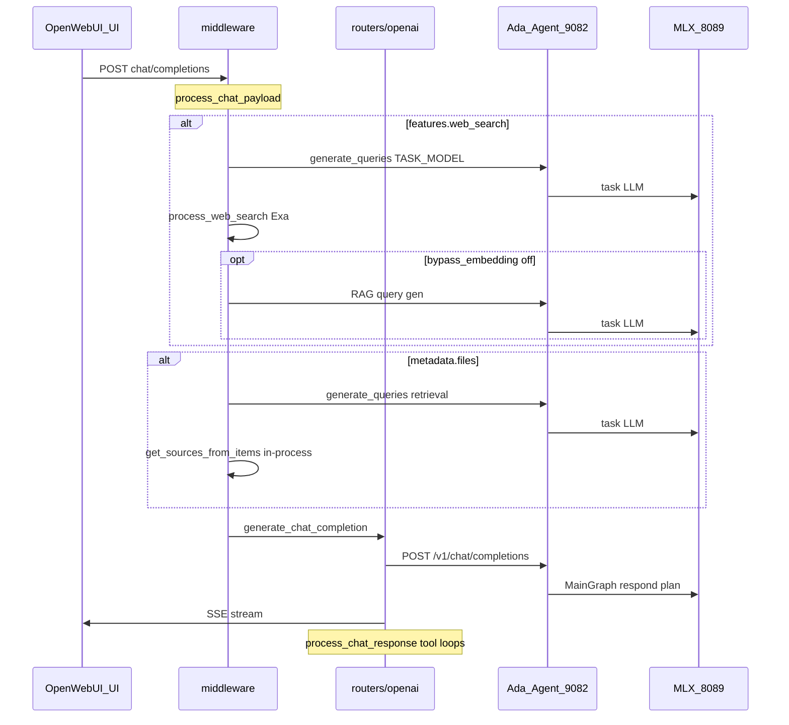

# OWUI Orchestration Audit (v0.6.42)

> Phase 0 산출물 · Ada LangGraph 마이그레이션 선행 분석  
> 벤더: [`web/open-webui`](../../../web/open-webui) tag `v0.6.42`

---

## 1. 채팅 1턴 — LLM 호출 그래프 (현재)



### 1.1 핵심 진입점

| 단계 | 파일 | 함수 | LLM? |
|------|------|------|------|
| Payload 전처리 | `utils/middleware.py` | `process_chat_payload` | 조건부 |
| Web search | `utils/middleware.py` | `chat_web_search_handler` | ✅ query gen |
| Files/RAG | `utils/middleware.py` | `chat_completion_files_handler` | ✅ query gen |
| Memory | `utils/middleware.py` | `chat_memory_handler` | ❌ (vector) |
| Upstream | `routers/openai.py` | `generate_chat_completion` L794 | ✅ main |
| Post-process | `utils/middleware.py` | `process_chat_response` | ✅ tool/code loops |

### 1.2 Task API (별도 HTTP)

| Endpoint | 파일 | upstream | metadata.task |
|----------|------|----------|---------------|
| `POST /api/v1/tasks/title/completions` | `routers/tasks.py` | `generate_chat_completion` → Agent | `TASKS.TITLE_GENERATION` |
| `POST .../tags/completions` | tasks.py | 동일 | `TASKS.TAGS_GENERATION` |
| `POST .../follow_up/completions` | tasks.py | 동일 | follow-up |
| `POST .../queries/completions` | tasks.py | 동일 | search/retrieval query |
| `POST .../auto/completions` | tasks.py | 동일 | autocomplete |

Task 호출도 **Agent MainGraph**를 탐 (plan/respond) — Phase 1 TaskGraph로 분리 대상.

---

## 2. RAG — `get_sources_from_items` (동등성 기준)

**위치:** `retrieval/utils.py` L921 `async def get_sources_from_items(...)`

**호출:** middleware `chat_completion_files_handler` L1006 — **HTTP 아님, in-process**.

### 2.1 `items[]` 타입별 처리

| `item.type` / 키 | 동작 |
|------------------|------|
| `file` | Files DB 또는 collection vector |
| `collection` | Knowledge full context 또는 hybrid vector |
| `web_search` | `docs[]` 직접 (Exa bypass embedding) |
| `collection_name` / `collection_names` | vector query |
| `docs` | bypass web search embedding |
| `note`, `chat`, `url` | 각 DB/loader |

### 2.2 왜 `POST /query/collection` 단독으로는 부족한가

- middleware는 **복합 items[]** + hybrid + rerank + full_context + web_search docs를 **한 함수**에서 처리.
- `query/collection` (retrieval.py L2345)은 **collection_names + 단일 query**만 — file/note/chat/url/web_search docs **미지원**.

**마이그레이션 결론 (D8):** Agent→OWUI는 **`POST /api/v1/ada/retrieval/sources`** overlay (내부 `get_sources_from_items` 래핑). JWT `get_verified_user` 재사용.

---

## 3. Web Search (현재)

| 단계 | 구현 | 비고 |
|------|------|------|
| 트리거 | `metadata.features.web_search` | 채팅 UI 토글 |
| Query gen | `generate_queries` → Agent TASK_MODEL | JSON `{"queries":[]}` |
| Search | `process_web_search` → `retrieval/web/exa.py` | Admin Exa key (→ vault 이전) |
| Inject | `files[]` + `rag_template` | middleware |

**마이그레이션:** query gen + Exa + inject → Agent `search_gate` + `search_batch` + `respond`.

---

## 4. Upstream Agent 호출 (openai.py)

`generate_chat_completion` L794:

1. `metadata`를 payload에서 **pop** (L807) — Agent에 metadata **기본 미전달**
2. `get_headers_and_cookies` (L903) — Authorization Bearer 전달
3. `POST {OPENAI_API_BASE_URL}/chat/completions` → Ada `:9082`

**overlay 필요 (Phase 1~2):**

| 헤더 | 내용 |
|------|------|
| `X-Ada-Request-Kind` | `chat` \| `task` \| `tool` |
| `X-Ada-Owui-Authorization` | `Authorization` 값 복사 (JWT) |
| `X-OpenWebUI-Metadata` | metadata JSON (JWT 제외, ≤64KB) |

---

## 5. Ada Agent 현재 (대조)

| 항목 | 현재 | 파일 |
|------|------|------|
| Graph | prepare→route→plan→respond | `agent/graph.py` |
| Task 구분 | 없음 | — |
| Search | 없음 | — |
| Tool | 별도 ToolGraph | `tool_nodes.py` |
| Profile | 단일 chat_profile | `model_registry.yaml` |

---

## 6. 마이그레이션 매핑表

| OWUI orchestration | 대체 | Phase |
|--------------------|------|-------|
| web search query gen | Agent search_gate (task LLM opt) | 2 |
| Exa HTTP | Agent search_batch + vault | 2 |
| get_sources_from_items | ada `/retrieval/sources` + JWT | 2 |
| rag_template inject | Agent respond SystemMessage | 2 |
| task title/tags/... | TaskGraph + X-Ada-Request-Kind | 1, 4 |
| MainGraph chat | UnifiedChatGraph | 2 |
| middleware inject | `ADA_AGENT_HANDLES_CONTEXT=1` skip | 3 |
| memory handler | `OwuiMemoryBackend` → `/memories/query` + JWT | 2 |
| OWUI server tool loop | Agent Unified `tool_loop` (D11) | 2 |
| process_chat_response tools | skip when `ADA_AGENT_HANDLES_CONTEXT` | 3 |

---

## 7. Overlay 패치 앵커 (v0.6.42)

| 파일 | 삽입 지점 | 목적 |
|------|-----------|------|
| `routers/openai.py` | L903 `headers, cookies = await get_headers_and_cookies` 직후 | metadata/JWT/RequestKind 헤더 |
| `routers/tasks.py` | 각 task `generate_chat_completion` 직전 | `request.state` 또는 header hint |
| `utils/middleware.py` | `process_chat_payload` 상단 | `ADA_AGENT_HANDLES_CONTEXT` early return |
| `routers/ada.py` | 신규 route | `/retrieval/sources`; memories는 기존 `/api/v1/memories/query` Agent 직접 호출 |
| `apply-overrides.py` | anchor tests | vendor 후 grep 검증 |

---

## 8. 검증 명령 (baseline)

```bash
# 현재 task가 Agent MainGraph 탐 — plan trace 확인
curl -s http://127.0.0.1:9082/health

# OWUI retrieval endpoint 존재
grep -n "query/collection" web/open-webui/backend/open_webui/routers/retrieval.py

# middleware LLM 경로
grep -n "generate_queries\|get_sources_from_items" web/open-webui/backend/open_webui/utils/middleware.py

# memory HTTP
grep -n "query_memory" web/open-webui/backend/open_webui/routers/memories.py
```

---

## 9. Memory (현재)

| 단계 | 구현 | LLM? |
|------|------|------|
| 트리거 | `features.memory` | — |
| Handler | `chat_memory_handler` → `query_memory` | ❌ vector only |
| HTTP | `POST /api/v1/memories/query` | JWT `get_verified_user` |

**마이그레이션 (D9–D10):** Agent `memory_gate` → `OwuiMemoryBackend` (JWT → `/memories/query`). Phase 3 middleware skip.

---

## 10. Tools (현재)

| 단계 | 구현 |
|------|------|
| Pre-upstream | middleware `tool_ids` / MCP → payload `tools[]` |
| Agent | `has_tools` → ToolGraph (`tool_graph.py`) |
| Post-upstream | `process_chat_response` server tool loop |

**마이그레이션 (D11):** Phase 2 Unified `tool_loop`; Phase 3 skip OWUI server loop.

---

## 11. Phase 3 middleware skip (`ADA_AGENT_HANDLES_CONTEXT=1`)

| Skip | Keep |
|------|------|
| chat_web_search_handler | convert_url_images, system prompt |
| chat_completion_files_handler (inject) | model/folder files → metadata.files |
| chat_memory_handler | image_generation, code_interpreter prompt |
| process_chat_response server tool loop | pipeline/filter inlet |
