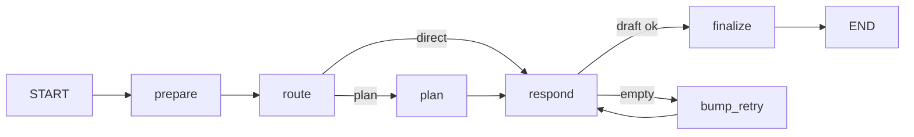

# Ada LangGraph MainGraph

Open WebUI는 **LangGraph agent API**(`:8082`)를 통해 MLX에 연결합니다. 터미널에서는 `ada ada-agent` CLI를 쓸 수 있습니다.

## 그래프 개요



| 노드 | 역할 |
|------|------|
| **prepare** | `agent.yaml` system prompt 주입 |
| **route** | 휴리스틱으로 direct / plan 분기 (추가 LLM 호출 없음) |
| **plan** | 복잡한 질문용 내부 계획 생성 (LLM 1회) |
| **respond** | 계획 힌트(선택)와 함께 본 답변 생성 |
| **bump_retry** | 빈 응답 시 재시도 카운터 증가 |
| **finalize** | `draft` → `AIMessage` 커밋 (실패 시 fallback) |

## 상태 (`AgentState`)

| 필드 | 설명 |
|------|------|
| `messages` | 대화 히스토리 (`add_messages` reducer) |
| `route` | `direct` \| `plan` |
| `plan` | plan 노드 출력 (내부용) |
| `draft` | respond 출력 (verify 전 임시) |
| `empty_retries` | 빈 응답 재시도 횟수 |

## 설정

[`ada/config/agent.yaml`](../../config/agent.yaml)

- `routing.plan_keywords` / `plan_min_chars` — plan 경로 트리거
- `plan.enabled` — plan 노드 on/off
- `verify.max_empty_retries` — 빈 MLX 응답 재시도

## 코드 레이아웃

```
ada/src/ada/agent/
├── config.py    # agent.yaml 로더
├── state.py     # AgentState
├── nodes.py     # prepare / route / plan / respond / finalize
├── graph.py     # build_main_agent_graph()
├── session.py   # REPL 세션
├── llm.py       # registry profile → LLM callable
├── content.py   # multimodal OpenAI content parse/preserve
├── openai_compat.py  # OpenAI messages ↔ MainGraph
└── server.py    # FastAPI /v1/chat/completions
```

## CLI

```bash
cd ada && pip install -e ".[dev]"
ada ada-agent                  # REPL
ada ada-agent --once "안녕"    # 한 턴
ada ada-agent --profile chat_profile
```

MLX 서버(`./scripts/serve-qwen.sh` 또는 `./scripts/ada.sh start`)가 떠 있어야 합니다.

## Open WebUI와의 관계

| 경로 | LangGraph |
|------|-----------|
| Browser → Open WebUI → **:8082 agent API** → MainGraph → MLX | **사용** |
| Terminal → `ada ada-agent` | **MainGraph** |
| (선택) `:8081` MLX proxy → MLX 직접 | 사용 안 함 |

Agent API 기동:

```bash
./scripts/ensure-ada-agent-server.sh
# 또는
./scripts/ada.sh start
```

Open WebUI Connections URL: `http://host.docker.internal:8082/v1` (키: `local`)

## Vision (이미지 대화)

Open WebUI가 보내는 `content: [{type:text}, {type:image_url}]` 형식을 agent API가 **그대로** MainGraph → MLX VLM까지 전달합니다.

- `content.py` — `parse_openai_content`, `ensure_user_prompt` (이미지만 있을 때 기본 질문 추가)
- `agent.yaml` → `vision.image_only_prompt`
- plan 노드도 multimodal user content 수신 (이미지 기반 계획 가능)
- `ADA_LLM_TIMEOUT` 기본 300s (VL prefill 지연)

검증: `./scripts/verify-agent-vision.sh`

## 향후 확장 (DESIGN_PLAN 3그래프)

| 그래프 | 상태 |
|--------|------|
| **MainGraph** | ✓ route → plan → respond → verify |
| ImprovementGraph | 미구현 (Spec 자기개선) |
| EvalGraph | 미구현 (회귀 golden) |

MainGraph의 `route`는 현재 키워드 휴리스틱이며, 이후 LLM 분류 또는 registry 프로필별 정책으로 교체할 수 있습니다.
