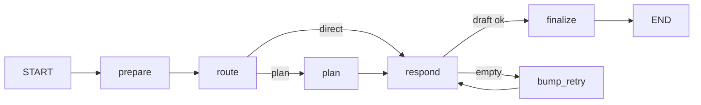

# Ada LangGraph MainGraph

Open WebUI는 **LangGraph agent API**(`:9082`)를 통해 MLX에 연결합니다. 터미널에서는 `ada ada-agent` CLI를 쓸 수 있습니다.

**전체 그래프 목록·라우팅·연관관계:** [LANGGRAPH.md](LANGGRAPH.md) (UnifiedChatGraph, TaskGraph, ToolAgentGraph, Email 그래프 포함)

## 그래프 개요



| 노드 | 역할 |
|------|------|
| **prepare** | `agent.yaml` system prompt 주입 |
| **route** | 휴리스틱으로 direct / plan 분기 (추가 LLM 호출 없음) |
| **plan** | 복잡한 질문용 내부 계획 생성 (LLM 1회) |
| **respond** | 계획 힌트(선택)와 함께 본 답변 생성 |
| **bump_retry** | 빈 응답 시 재시도 카운터 증가 |
| **finalize** | `draft` → `AIMessage` 커밋 (실패 시 fallback) |

## 상태 (`AgentState`)

| 필드 | 설명 |
|------|------|
| `messages` | 대화 히스토리 (`add_messages` reducer) |
| `route` | `direct` \| `plan` |
| `plan` | plan 노드 출력 (내부용) |
| `draft` | respond 출력 (verify 전 임시) |
| `empty_retries` | 빈 응답 재시도 횟수 |

## 설정

[`ada/config/agent.yaml`](../../config/agent.yaml)

- `routing.plan_keywords` / `plan_min_chars` — plan 경로 트리거
- `plan.enabled` — plan 노드 on/off
- `verify.max_empty_retries` — 빈 MLX 응답 재시도

## 코드 레이아웃

```
ada/src/ada/agent/
├── config.py    # agent.yaml 로더
├── state.py     # AgentState
├── nodes.py     # prepare / route / plan / respond / finalize
├── graph.py     # build_main_agent_graph()
├── session.py   # REPL 세션
├── llm.py       # registry profile → LLM callable
├── content.py   # multimodal OpenAI content parse/preserve
├── openai_compat.py  # OpenAI messages ↔ MainGraph
└── server.py    # FastAPI /v1/chat/completions
```

## CLI

```bash
cd ada && pip install -e ".[dev]"
ada ada-agent                  # REPL
ada ada-agent --once "안녕"    # 한 턴
ada ada-agent --profile chat_profile
```

LLM 서버(`http://127.0.0.1:8080/v1`, 외부 기동)와 `./scripts/ensure-ada-agent-server.sh` 또는 `./scripts/ada.sh start`가 필요합니다.

## Open WebUI와의 관계

| 경로 | LangGraph |
|------|-----------|
| Browser → Open WebUI → **:9082 agent API** → **UnifiedChatGraph** → MLX | **사용** (일반 채팅) |
| OWUI task (제목·태그 등) → **TaskGraph** | **사용** |
| OWUI tools-only 요청 → **ToolAgentGraph** (single-shot) | **사용** |
| Terminal → `ada ada-agent` | **MainGraph** |
| (선택) `:9081` MLX proxy → MLX 직접 | 사용 안 함 |

Agent API 기동:

```bash
./scripts/ensure-ada-agent-server.sh
# 또는
./scripts/ada.sh start
```

Open WebUI Connections URL: `http://host.docker.internal:9082/v1` (키: `local`)

## 실시간 스트리밍 (기본 ON)

`./scripts/ada.sh restart` 후 Open WebUI에서 **새 채팅**을 열면 LangGraph LLM 출력이 SSE로 실시간 표시됩니다.

| 구간 | SSE | UI (Open WebUI) |
|------|-----|-----------------|
| route / plan / verify trace | `content` (`<think>` 안) | 같은 말풍선 안 **접이식 Thinking** |
| **respond** 노드 | `content` (태그 밖) | 말풍선 본문 답변 |

| 모드 | 동작 |
|------|------|
| `ADA_AGENT_FORCE_NON_STREAM=0` (기본) | `stream:true` → SSE |
| `ADA_AGENT_FORCE_NON_STREAM=1` | buffered JSON (구 Open WebUI 호환) |
| tools 요청 | 항상 buffered |

설정: [`ada/config/agent.yaml`](../../config/agent.yaml) → `stream.inline_thinking`, `expose_graph_trace`

검증:

```bash
./scripts/ada.sh restart
python scripts/test_openwebui_stream.py --agent-only --require-sse
python scripts/test_openwebui_stream.py --agent-only --plan-smoke --require-sse
```

## Vision (이미지 대화)

Open WebUI가 보내는 `content: [{type:text}, {type:image_url}]` 형식을 agent API가 **그대로** UnifiedChatGraph / MainGraph → MLX VLM까지 전달합니다.

- `content.py` — `parse_openai_content`, `ensure_user_prompt` (이미지만 있을 때 기본 질문 추가)
- `agent.yaml` → `vision.image_only_prompt`
- plan 노드도 multimodal user content 수신 (이미지 기반 계획 가능)
- `ADA_LLM_TIMEOUT` 기본 300s (VL prefill 지연)

검증: `./scripts/verify-agent-vision.sh`

## 구현된 그래프 (요약)

| 그래프 | 상태 |
|--------|------|
| **UnifiedChatGraph** | ✓ OWUI 프로덕션 채팅 (memory/search/RAG/tools + MainGraph 후반) |
| **MainGraph** | ✓ CLI·regression (route → plan → respond → verify) |
| **TaskGraph** | ✓ OWUI title/tags/follow-up/autocomplete |
| **ToolAgentGraph** | ✓ function-calling (single-shot + Unified execute loop) |
| **EmailSummarizeGraph / EmailDraftGraph** | ✓ Gmail inbox + 회신 초안 |
| ImprovementGraph / EvalGraph | 미구현 (DESIGN_PLAN) |

상세: [LANGGRAPH.md](LANGGRAPH.md). MainGraph의 `route`는 현재 키워드 휴리스틱이며, 이후 LLM 분류 또는 registry 프로필별 정책으로 교체할 수 있습니다.

## Gmail 이메일 대화 API (신규)

Main agent 서버(`:9082`)에 이메일 커넥터 API가 함께 노출됩니다.

### 엔드포인트

- `POST /ingest/gmail/webhook` — Gmail 수신 메시지 적재(idempotent)
- `POST /process/message/{gmail_message_id}` — 정책 평가 (Ada 호명 + 회신 요청)
- `GET /ops/email/actions?status=pending_review` — 리뷰 대기 목록
- `POST /ops/email/actions/{id}/approve-send` — 승인 후 발송
- `POST /agent/email/draft` — 스레드 컨텍스트 기반 회신 초안 생성

### 정책 요약

- 자동 회신 트리거: **Ada 호명 + 회신 요청 의도** 동시 만족
- 차단 규칙: `noreply`, 자동응답 헤더(`Auto-Submitted`), 메일링리스트(`List-Id`)
- 처리 결과는 `email_actions`, `email_audit_logs`에 기록

### 저장소

- 기본 DB: `ada/data/email_connector.sqlite3`
- 환경변수로 변경: `ADA_EMAIL_DB_PATH=/path/to/email.sqlite3`
