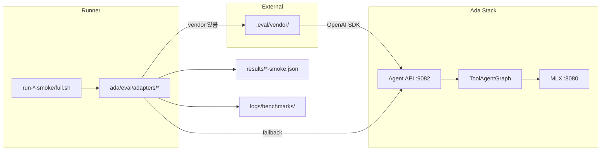

# Ada Agent Benchmark — 구현 정리

LangGraph **Agent API (`:9082`)** 를 평가 대상으로 하는 5개 업계 벤치마크 연동 현황입니다.  
Open WebUI와 동일 경로(Agent → MLX)로 모델을 호출합니다.

> 실행 가이드: [README.md](./README.md)  
> Contract regression: [../regression/README.md](../regression/README.md)

---

## 1. 아키텍처



### 평가 경로

| 계층 | 역할 |
|------|------|
| **Contract regression** | MainGraph·Agent API·vision 계약 (mock, ~0.3s) |
| **Eval smoke** | 벤치 5종 소량 태스크 + Agent API 연동 검증 |
| **Eval full (harness)** | `eval.yaml` full 설정 기준 확대 fallback |
| **Eval full (vendor)** | 공식 벤치 runner — vendor 설치 후 (미완/부분) |

### ToolAgentGraph (Phase 0)

요청에 `tools` 필드가 있으면 Agent server가 ToolAgentGraph로 분기합니다.

| 파일 | 역할 |
|------|------|
| [`ada/src/ada/agent/tool_graph.py`](../../../ada/src/ada/agent/tool_graph.py) | ReAct-style tool loop |
| [`ada/src/ada/agent/tool_nodes.py`](../../../ada/src/ada/agent/tool_nodes.py) | LLM 호출, 로컬 noop 실행 |
| [`ada/src/ada/agent/server.py`](../../../ada/src/ada/agent/server.py) | `tools` 있음 → ToolAgentGraph |

벤치 harness는 **한 번의 API 호출당 한 턴**을 보내고, 멀티턴·tool 결과는 벤치 runner(또는 fallback 루프)가 처리합니다.

---

## 2. 벤치마크 5종

### 요약표

| ID | 이름 | Adapter | Vendor | Smoke | Full (harness) | Vendor runner |
|----|------|---------|--------|-------|----------------|---------------|
| `tau2` | τ²-bench | `tau2_adapter.py` | `amazon-agi/tau2-bench-verified` | 5 tasks, mock | 50 tasks, multi-domain | τ² `uv run` (부분) |
| `bfcl` | BFCL v4 | `bfcl_adapter.py` | `ShishirPatil/gorilla` | 10 entries | 100 entries | `openfunctions_evaluation.py` (부분) |
| `swe` | SWE-bench Verified | `swe_adapter.py` | `SWE-bench/SWE-bench` | 1 instance | 1 instance | Docker harness **미연동** |
| `toolsandbox` | ToolSandbox | `toolsandbox_adapter.py` | `apple/ToolSandbox` | 3 scenarios | 30 scenarios | **미연동** |
| `mcpagent` | MCPAgentBench | `mcpagent_adapter.py` | `ADA_MCPAGENTBENCH_REPO` | 5 tasks | 50 tasks | **미연동** |

**현재 baseline (2026-06-07):** smoke harness-fallback 기준 **pass_rate 1.0** — [`baseline.json`](../../../ada/src/ada/eval/results/baseline.json)

---

### 2.1 τ²-bench (Tau-squared)

**목적:** 멀티턴 대화·도구 사용·user proxy 시뮬레이션 (airline / retail / telecom / mock)

| 항목 | 내용 |
|------|------|
| Vendor | [amazon-agi/tau2-bench-verified](https://github.com/amazon-agi/tau2-bench-verified) |
| 설정 | [`eval.yaml`](../../../ada/src/ada/eval/config/eval.yaml) → `benchmarks.tau2` |
| Smoke | domain=`mock`, 5 tasks |
| Full (harness) | domains=`airline,retail,telecom,mock`, 50 tasks |
| 스크립트 | `./scripts/eval/run-tau2-smoke.sh` / `run-tau2-full.sh` |
| Vendor 연동 | vendor + `uv` 있으면 `tau2.run` subprocess 시도 |
| Fallback | Agent API에 tools 포함 소량 프롬프트 호출 |

---

### 2.2 BFCL v4 (Berkeley Function-Calling Leaderboard)

**목적:** 함수/툴 호출 정확도 (AST + exec, Agentic v4)

| 항목 | 내용 |
|------|------|
| Vendor | [ShishirPatil/gorilla](https://github.com/ShishirPatil/gorilla) → `berkeley-function-call-leaderboard` |
| 설정 | `test_category: simple_python`, smoke 10 / full 100 entries |
| 스크립트 | `./scripts/eval/run-bfcl-smoke.sh` / `run-bfcl-full.sh` |
| Vendor 연동 | `openfunctions_evaluation.py --model ada-agent` |
| Fallback | `get_weather` tool 호출 프롬프트 반복 |

---

### 2.3 SWE-bench Verified

**목적:** GitHub 이슈 → patch → test (코딩 에이전트)

| 항목 | 내용 |
|------|------|
| Vendor | [SWE-bench/SWE-bench](https://github.com/SWE-bench/SWE-bench) |
| 설정 | smoke instance `django__django-11099` |
| 스크립트 | `./scripts/eval/run-swe-smoke.sh` / `run-swe-full.sh` |
| 전제 | Docker (full 시 필수) |
| Vendor 연동 | **미구현** — docker eval harness 미연결 |
| Fallback | Agent API에 fix summary 1회 요청 |

---

### 2.4 ToolSandbox (Apple)

**목적:** stateful 멀티턴·동적 user proxy (BFCL 단발성 보완)

| 항목 | 내용 |
|------|------|
| Vendor | [apple/ToolSandbox](https://github.com/apple/ToolSandbox) |
| 설정 | smoke 3 / full 30 scenarios |
| 스크립트 | `./scripts/eval/run-toolsandbox-smoke.sh` / `run-toolsandbox-full.sh` |
| Vendor 연동 | **미구현** |
| Fallback | `set_reminder` tool 호출 시나리오 |

---

### 2.5 MCPAgentBench

**목적:** MCP tool 선택 + distractor 환경 (arXiv 2512.24565)

| 항목 | 내용 |
|------|------|
| Vendor | `ADA_MCPAGENTBENCH_REPO` 환경 변수로 pin |
| 설정 | smoke 5 / full 50 tasks |
| 스크립트 | `./scripts/eval/run-mcpagent-smoke.sh` / `run-mcpagent-full.sh` |
| MCP shim | [`mcp_client.py`](../../../ada/src/ada/eval/harness/mcp_client.py) — MCP → OpenAI tools schema |
| Vendor 연동 | **미구현** |
| Fallback | `search_docs` vs distractor tool 선택 |

---

## 3. Harness vs Vendor vs Fallback

동일 스크립트(`run-*-full.sh`)라도 **실제로 무엇이 돌았는지**는 결과 JSON으로 구분합니다.

| `extra.source` | 의미 |
|----------------|------|
| `harness-fallback` | Ada가 Agent API로 직접 소량 태스크 실행 (vendor 미사용) |
| `harness-fallback-after-vendor-failure` | vendor 실행 시도 후 실패 → fallback |
| (vendor 성공 시) | vendor runner JSON — `vendor_ran: true` |

**디버깅 필드 (`extra`):**

```json
{
  "source": "harness-fallback",
  "requested_mode": "full",
  "vendor_available": false,
  "vendor_ran": false,
  "fallback_reason": "vendor missing: .../tau2-bench-verified",
  "benchmark_log": "ada/src/ada/eval/logs/benchmarks/...",
  "subprocess_log": "ada/src/ada/eval/logs/subprocess/..."
}
```

> `--benchmark-mode full`이 몇 분 만에 끝나면 **vendor full이 아니라 harness fallback**일 가능성이 큽니다.  
> `fallback_reason`과 `logs/`를 확인하세요.

---

## 4. 디렉터리 구조

```
ada/src/ada/eval/
├── config/eval.yaml           # endpoint, smoke/full limits, baseline
├── adapters/
│   ├── _common.py             # begin_benchmark, annotate_result, save
│   ├── tau2_adapter.py
│   ├── bfcl_adapter.py
│   ├── swe_adapter.py
│   ├── toolsandbox_adapter.py
│   └── mcpagent_adapter.py
├── harness/
│   ├── agent_client.py        # OpenAI SDK → :9082
│   ├── stack_check.py         # Agent/MLX alive
│   ├── results.py             # JSON schema, baseline compare
│   ├── report.py              # Markdown 리포트 생성
│   ├── run_log.py             # 세션/벤치/subprocess 로그
│   ├── subprocess_runner.py
│   └── mcp_client.py
├── results/
│   ├── baseline.json          # PR regression 기준 (tracked)
│   ├── snapshot-*-latest.json # run 스냅샷
│   └── *-{smoke,full}.json    # 벤치별 결과 (gitignore)
├── reports/                   # Markdown/JSON 리포트 (latest gitignore)
└── logs/                      # 실행 로그 (gitignore)
    ├── sessions/
    ├── benchmarks/
    └── subprocess/

ada/tests/regression/eval/     # @pytest.mark.eval_smoke
scripts/eval/                  # install-vendors, run-*-*.sh
scripts/verify-regression-full.sh
```

---

## 5. 실행 명령

### 한방 (권장)

```bash
./scripts/ada.sh start
./scripts/verify-regression-full.sh
./scripts/verify-regression-full.sh --update-baseline
```

### 벤치 개별

```bash
./scripts/eval/run-tau2-smoke.sh
./scripts/eval/run-bfcl-full.sh
# ...
```

### Vendor 설치

```bash
./scripts/eval/install-vendors.sh
export ADA_MCPAGENTBENCH_REPO=<url>   # MCPAgentBench (선택)
```

### 환경 변수

| 변수 | 기본값 | 설명 |
|------|--------|------|
| `ADA_EVAL_BASE_URL` | `http://127.0.0.1:9082/v1` | Agent API |
| `ADA_EVAL_VENDOR_ROOT` | `.eval/vendor` | vendor clone 경로 |
| `ADA_AGENT_PROFILE` | `chat_profile` | [`model_registry.yaml`](../../../ada/config/model_registry.yaml) |
| `ADA_EVAL_RUN_LIVE` | `1` (full regression 시) | live pytest 활성화 |
| `ADA_EVAL_TIMEOUT` | vendor별 3600~7200 | subprocess timeout (초) |

---

## 6. 결과·리포트·로그

### 결과 JSON (공통 스키마)

```json
{
  "benchmark": "tau2",
  "mode": "smoke",
  "timestamp": "ISO8601",
  "endpoint": "http://127.0.0.1:9082/v1",
  "model": "openapi-resolved",
  "tasks_total": 5,
  "tasks_passed": 5,
  "pass_rate": 1.0,
  "duration_sec": 4.22,
  "task_ids": ["mock-001", "..."],
  "extra": { "...": "..." }
}
```

### 리포트 (Markdown)

| 트리거 | 파일 |
|--------|------|
| `verify-regression.sh` | `reports/contract-latest.md` |
| `verify-regression-eval-smoke.sh` | `reports/eval-smoke-latest.md` |
| `verify-regression-full.sh` | `reports/full-regression-latest.md` |
| `run-*-*.sh` | `reports/benchmark-<id>-<mode>-latest.md` |
| (자동 갱신) | `reports/summary-latest.md` |

이력: `reports/history/<timestamp>-*.md`

### 로그

| 종류 | 경로 |
|------|------|
| Full regression 세션 | `logs/latest-full-regression-<mode>.log` |
| 벤치마크 | `logs/benchmarks/<timestamp>-<id>-<mode>.log` |
| Subprocess | `logs/subprocess/<timestamp>-*.log` |

---

## 7. Regression · CI

| Tier | 명령 | pytest marker |
|------|------|---------------|
| Contract | `./scripts/verify-regression.sh` | `@pytest.mark.regression` |
| Eval smoke | `./scripts/verify-regression-eval-smoke.sh` | `@pytest.mark.eval_smoke` |
| Full | `./scripts/verify-regression-full.sh` | contract + eval + 벤치 |

**Baseline 규칙:** `pass_rate >= baseline.pass_rate - 0.05` (δ=0.05, [`eval.yaml`](../../../ada/src/ada/eval/config/eval.yaml))

**CI:** [`.github/workflows/ada-eval-smoke.yml`](../../../.github/workflows/ada-eval-smoke.yml) — harness mock만 (Agent/MLX 없음). Live eval은 로컬.

---

## 8. 구현 상태 · 로드맵

### 완료

- [x] ToolAgentGraph + Agent API `tools` / `tool_calls` passthrough
- [x] 5종 adapter + smoke/full 스크립트
- [x] harness fallback (Agent API 연동 검증)
- [x] baseline / snapshot / Markdown 리포트
- [x] 실행 로그 (`run_log.py`)
- [x] `verify-regression-full.sh` 한방 runner
- [x] τ² / BFCL vendor subprocess **시도** (vendor 설치 시)

### 미완 / 다음 단계

- [ ] SWE-bench Docker harness 연동
- [ ] ToolSandbox 공식 evaluator 연동
- [ ] MCPAgentBench repo pin + runner
- [ ] Vendor full 규모 (τ² ~280+, BFCL 1800+, SWE 500) — 로컬 MLX 며칠 소요 예상
- [ ] CI self-hosted runner + MLX (optional live smoke)

---

## 9. 관련 커밋

| 커밋 | 내용 |
|------|------|
| `46f2be49` | Agent eval benchmarks, ToolAgentGraph, report |
| `d55061f8` | smoke baseline snapshot (harness-fallback 100%) |

---

## 10. FAQ

**Q. full이 왜 며칠 안 걸리나요?**  
A. vendor 미설치 또는 runner 미연동 시 **harness fallback**으로 소량 태스크만 실행됩니다. `extra.fallback_reason`과 `logs/`를 확인하세요.

**Q. 공식 벤치 점수를 내려면?**  
A. `./scripts/eval/install-vendors.sh` → vendor runner 성공 (`vendor_ran: true`) → full 규모 설정 (`eval.yaml` full 섹션).

**Q. Contract regression과 차이는?**  
A. Contract는 mock 단위 **API 계약**. Eval은 **실제 MLX + Agent API** 경유 tool-use·멀티턴 검증입니다.
